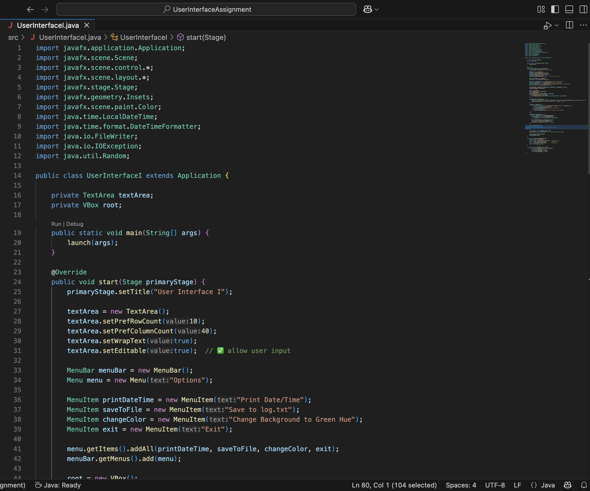
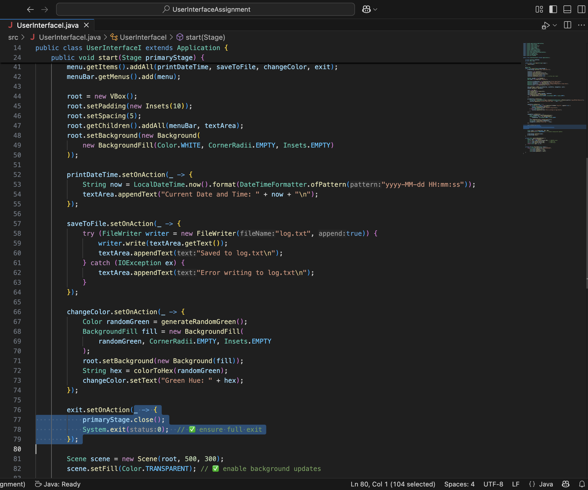
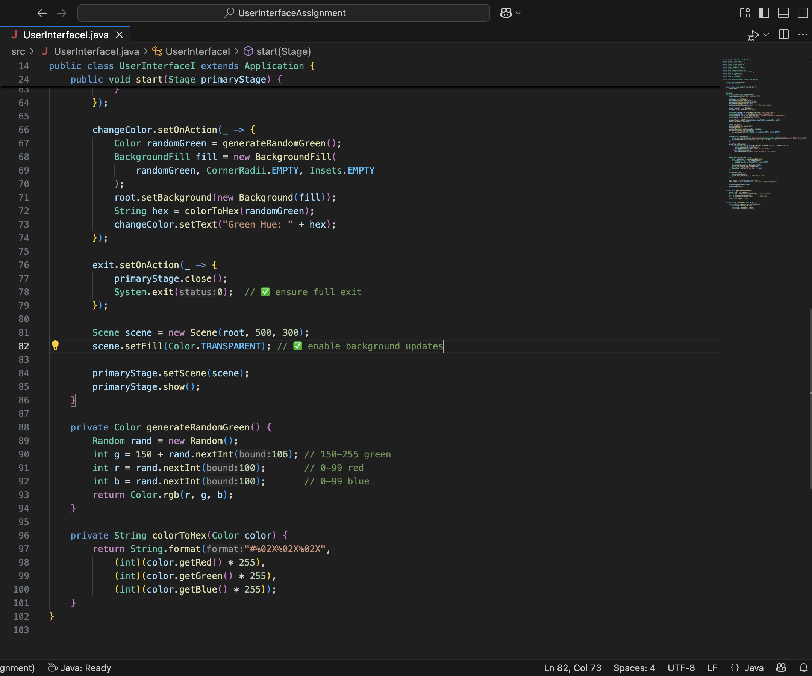
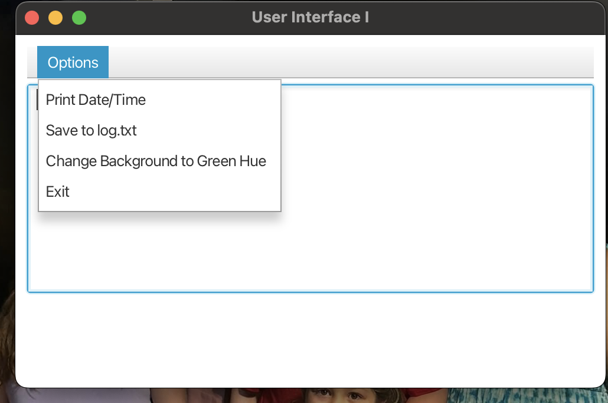
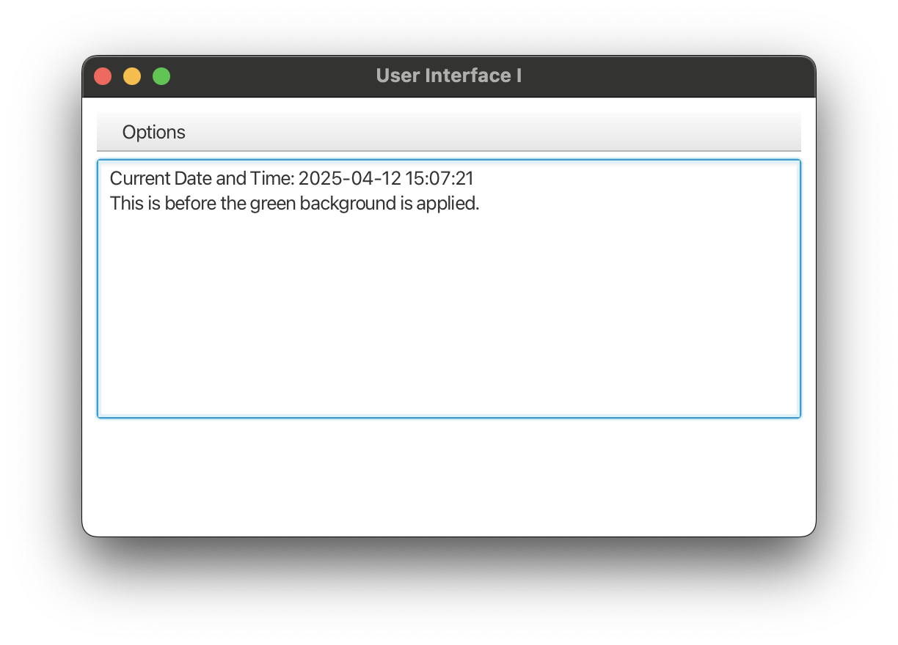
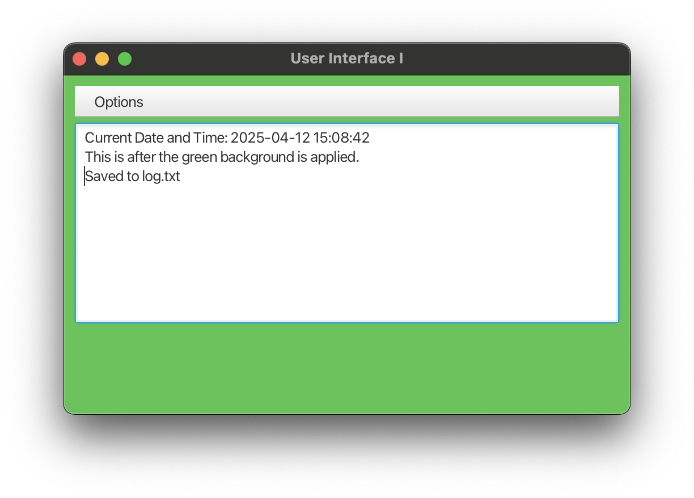

# JavaFX User Interface Assignment

This JavaFX application includes a menu with interactive features for displaying the current date and time, saving logs, changing background color, and exiting the app.

## 💻 Java Source Code





## ▶️ Running the App


## 📂 Application Features

### Menu Options



### Show Date and Time



### Change to Random Green Background + Save to Log




## 🌐 GitHub Repository

*(Add your GitHub screenshot here once uploaded)*

---

## ⚙️ Requirements

- Java 17+
- JavaFX SDK 24

## 🔧 How to Compile and Run

```bash
javac --module-path /path/to/javafx-sdk-24/lib --add-modules javafx.controls -d out src/UserInterfaceI.java
java --module-path /path/to/javafx-sdk-24/lib --add-modules javafx.controls -cp out UserInterfaceI
- Replace /path/to/javafx-sdk-24/lib with the correct path on your system.