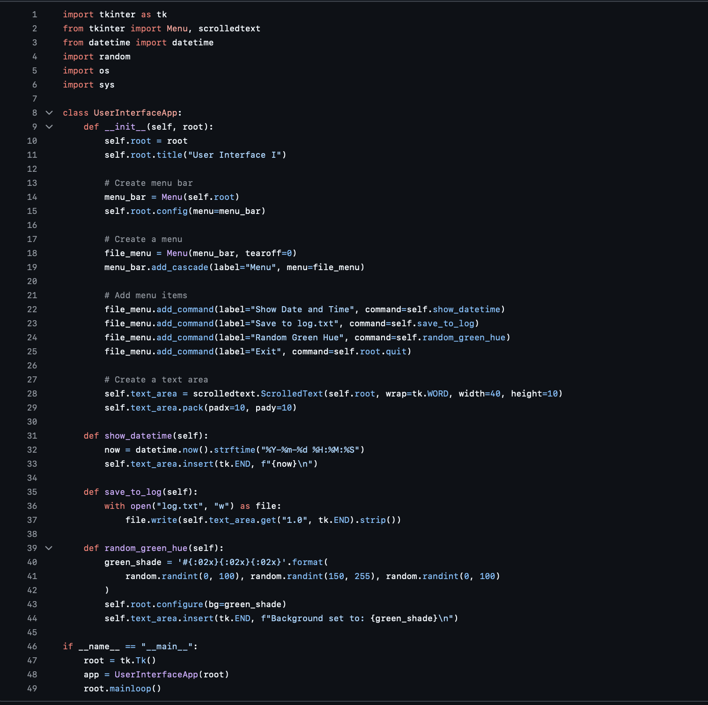
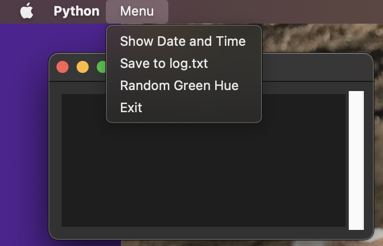
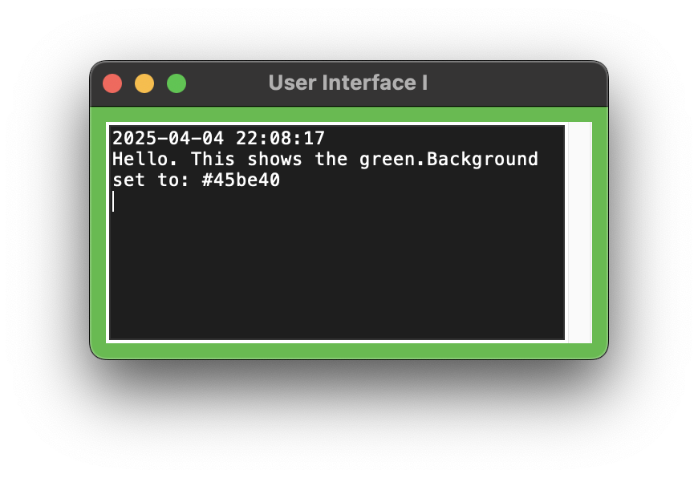
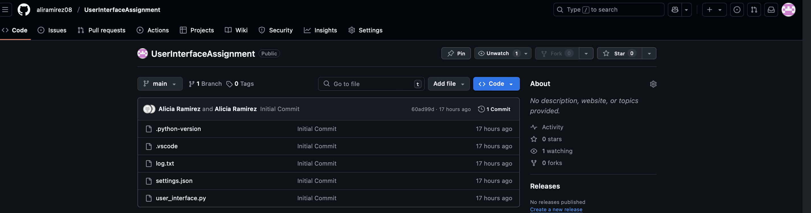
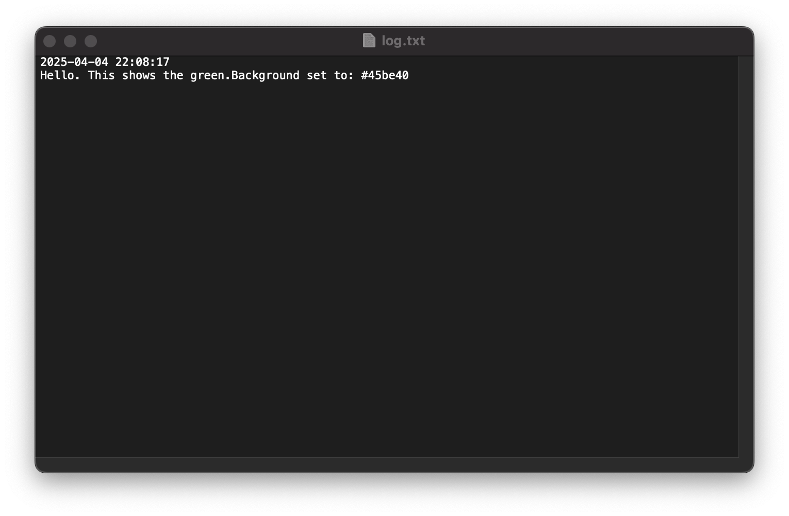

# User Interface I Assignment

The application provides a simple graphical user interface (GUI) with a top bar menu that performs various actions based on user selection.

## Features

- **Display Date and Time**  
  Prints the current date and time into the text area.

- **Save to File**  
  Saves the contents of the text area to `log.txt`.

- **Random Green Hue Background**  
  Changes the window background to a random shade of green and logs the hex color used.

- **Exit**  
  Closes the application.

## Technologies Used

- Python 3.10.11  
- `tkinter` (built-in GUI module for Python)

## How to Run

1. Clone this repository:
   ```bash
   git clone https://github.com/aliramirez08/UserInterfaceAssignment.git
   cd UserInterfaceAssignment

2. Make sure you are using Python 3.10.11 (or later with Tkinter support)

3. Run the application:
    ```bash
    python3 user_interface.py

## Screenshots

### Python Source Code (VS Code)


### Application Running
**First View**


**Second View / Background Color Change**


### GitHub Repository


### Saved Log File Output


